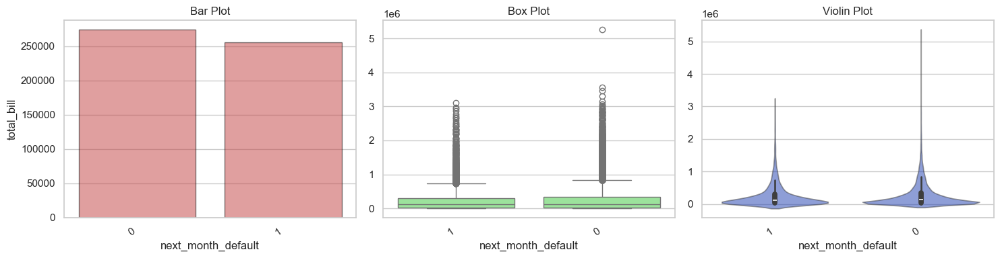
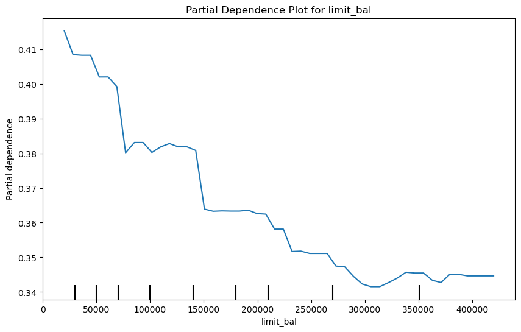

# Data Processing
## Data Info
- The dataset has 25247 rows and 27 columns
- The age column has 126 Null values
## Train Test Split
- we have used 90:10 split into train and test respectively.
- We will not split to find a validation set because we will be using 5 fold corss validation
## Null values:
- Since the null values were too less in number we considered removing them from the training data set
## Columns Preprocessing
### Customer Id
- We removed the customer id column since it was not useful in predictive modellling
- **Duplicates** : There were 636 duplicates after removing the customer id so we removed them too.
### Marriage
- Marriage column has category 0 which was not described in the pdf hence we merged it with 3 as 'others'
### Education
- There were again various levels of education like 0,5,6 which were not described hence we merged it with 4 as others.
### Pay_1 to pay_6
- Pay_1 was missing in the columns and instead it was pay_0 and then pay_2 and so on thus i replaced pay_0 as pay_1
### Average Bill amount
- This Coloumn had a few errors while calculating the average of the bill amount for the last 6 months so i recalculated this column using the data of all 6 months
### Pay to Bill ratio
- I recalculated this column as well due to the presence of negative values
- Added a small value epsilon to the bill amount while dividing to avoid division by 0

# Exploratory Data Analysis

## Univariate Analysis
### Marriage

- singles and married people have almost similar contribution in the marriage column
- others have just 1.3% strength in marriage column
### SEX

- 60 percent of them are males
### Education

- 46 percent of them have completed UG and around 35 percent have done higher studies so all in all around 80 percent of the data are well educated so we dont expect them to default (expect)
### Payment status
- for the past 6 month data all of them had around 50 percnt of them paying it on time but may not have paid in full
### Age

- median is around 35 and there only a handfull number of people above 60 years of age
- This is not normally distributed according to both shapiro_wilk and anderson_darling
### Limit

- mostly the limit is between 1 and 2 lakhs but the maximum has even gone up to 10 lakhs

- Note: Seeing the correlations matrix it is evident that there is no special connection between these columns

## Bivariate Analysis
### marriage vs limit_bal

- Avg limit for married people are a bit higher than that of single and others have significantly lesser mean
### Limit vs education

- As expected people with highest education have high limit but people with educations as 4 ("others") have the second highest which is strange may be because they are influential or rich people with not much of education background 
### Age vs limit

- Nothing worth noting according to the scatter plot but has a spearman correlation of about 0.2 so can't be discarded straight away
### total_bill and total_pay
- have a spearman correlation of 0.6 which means more the bill more the payment which is quite obvious
### total_pay vs education

- people with "other" education qualification have the highest avergae total payment followed by the ones with highest education qualification
### total_bill vs education

- no suprises the other education category have the highest spendings as well but the intresting to note here is that eventhough the people with bachelors qualification have lesser total_payements than those with highest qualification, they have higher bill_amt compared to the master guys showing that may be this is the audience failing to complete the payment!!
### total_pay vs marriage

- those with other as their marriage category have the highest mean total_payment but since they are less in number,hence not a trusthworthy result whereas the married and single guys are about the same with married having a slight lead (understandably so)
- statistically there is no association between these two vatiables according to the anova test
### total_bill vs marriage

- the bill for married people are the highest as expected but its not leading by a heavy amount.
- since both total_pay and total_bill are not normally distrbuted hence it is obvious that we trust kruskal wallis more than anova and hence we say that they are not statistically associated with each other
- intresting insight is that people with 3 marriage  have a lot of payment but less bill so they have reduced the use of credit card and paying their old debts
### Marriage vs default

- the number of defaults between married and unmarried are very similar in number. 
- these variables are statistically related according to the chi-sqaured test
### Gender vs default

- men had both higher default rate and not default rate which is onviously due to high number of men in the data
### default vs education

- as expected those with ug degrees have the highest contribution to the default lot and those with lower education ( high school ) have lower default rate than the masters guys , may be it's because they dont use the credit card often
### default vs limit

- the avg limit of those who default are lower than those who dont default 
### total_pay and total_bill vs default

- obviously those with lower total_pay are the ones who would eventually default but the total_bill is little lesser in the past 6 months for those who default. probably this is because the defaulters are concentrating on paying the bill rather than increasing bill_amt, they have become cautious
### age vs default
- since age was not normally distributed we go with kruskal wallis test which says that there is not statistical significance between these variables
## Temporal Analysis

### pay amount over the past 6 months
- quite evidently those who defaulted could pay very little of the amount in the past 6 months
### bill amount for the past 6 months
- people both defaulter and non defaulters became serious during month 3
## Analysing Derived column
### Due

- the total due that person is having according to the past 6 months
- intrestingly it is not associated with the default rate
### Average Utilization

- Analysed a new column called average utilization which is the ratio of avg_bill_amt (which is equivalent to spending)
- It's clear that defaulters have higher utilization than those who don't which is expected
### Deliquency Score

- It is very clear that the defaulters have a higher deliquency score (sum of payment status for the past 6 months), more then deliquency score more he has missed payments
- point to note is that median of deliquency score for non-defaulters is 0 so mostly they pay on time if not full every time

### Consistency Score

- I tried modelling the behaviour of payments of the data and found out the defaulters are more consistent than the non defaulters , meaning they consistently failed to pay the bill wheras the non defaulters either had no consumption(-2), paid in full or paid the min amount and sometimes they might have missed by some amounts.

### Outlier Analysis 
- There are 11 people with high credit card limit (above the maxima of the boxplot ) but still have defaulted. Since it is only 11 of them the credit limit has been assigned quite well
- And there is no scope of increasing the limit of any of them as the count of low limit guys not defaulting is 0.
- Note: Another intresting insight is that the bill_amt for the past 6 months are highly correlated 

# Modelling
- Modelling was carried out in 3 steps with using weighted loss function,SMOTE-NC for synthetic data and finally post shap analysis which eventually helped us in feature selection
- For all types of modelling I have used stratified k-fold cross validation (k=5) and then averaged out the results for each fold to print it in the classification reports
## Modelling-1 (Using Weighted Cost function)
- we have started modelling with all the features
- Weights assigned to the classes were
   - 0.62 for those who **don't default**
   - 2.54 for those who **default**
- We used Models like LightGBM,Catboost,XGboost,Support vector Classifier with RBF kernel, Random Forest and Logistic Regression
## Modelling-2 (Using SMOTE-NC)
- SMOTE-NC is an extension of SMOTE wherein we handle the categorical features by assigning points based on interpolation of numerical values of k-nearest neighbours and majority of the categorical Variable
- In this modelling technique we performed smote-nc for each of 4 folds used for training and kept the 5th fold seperate for validation.(smote is performed for each fold to avoid )
- Again we used the same modelling technqiues like LightGBM,Catboost,XGboost,logistic Regression,Random Forest and support vector classifier
## Report of the models used above

* train1 denotes the modelling techniques where we have used weighted loss functions and train2 denotes the modelling techniques where we have used SMOTE-NC for interpolating
## Light Geadient Boosting-:
- LightGBM trained on weighted cost function gave us the best F1-score. Considering our priority at the moment is to have good precision and recall hence we go with F1-score.
### Threshold Tuning
- We used the same 5 fold cross validation to tune the threshold to acheive the best F1-score
- We got the final Threshold as 0.57
- We used the weighted cost function and then retrained the model on the complete training set . We got a f1 score of 0.64 on training set for the minority class 

## Result
- On the test set the light gbm model gave 0.51 f1 score on the minority class. This difference in performance between the train and test is due to the heavy class imbalance and slight variations in the distrbutions of some of it's features .

## Train vs Test distribution

- we can see that most of the distributions remain same but only the pay_to_bill ration is a appears a little different
## ROC-AUC

- ROC-AUC score of 0.79 on the test set
# Post Modelling Analysis

- Payment status one month before has the highest impact on wheather the customer would default or not
- Features like deliquency Score and average utlization are having high shap values

## Bee Swarm Plot

### Intresting Insights from the post modelling analysis using SHAP 
#### PAY-1
- Higher values of pay_1 correspond to higher shap values which is increasing or probability of defaulting. hence more the months of delay higher the chance to default
#### Deliqeuncy Score
- Lower deliquency scores hvae negative shap values meaning it is reducing the probability of defaulting which aligns with intuition
#### Utilization
- Lesser utilization of credit card is helping in reducing the risk of defaulting and high utlization is indeed increasing the risk but not as much as deliquency ans pay_1
#### Pay_amt2
- High values of pay_amt2 meaning he has paid a lot of money 2 months ago are infact reducing the probablity of defaulting . He has got rid of a lot of burden i suppose.
- intresting insight is that this feature has a higher importance than pay_amt1
#### Education
- shap value of education is not high (0.05) but a nice thing to see is that lowest education is actually leading to decrese in the probability of defaulting
#### Limit Balance
- High Limit balance is a proof that he is not among defaulters and the bee swarm plot proves it

## Partial Dependency Plots
### Limit vs Default

- Clearly we can see that as balance is increasing then the probability of default is also decreasing 
### Age vs Default

# Final Validation Dataset-:

- The Default rate in the final dataset is 28.41%
